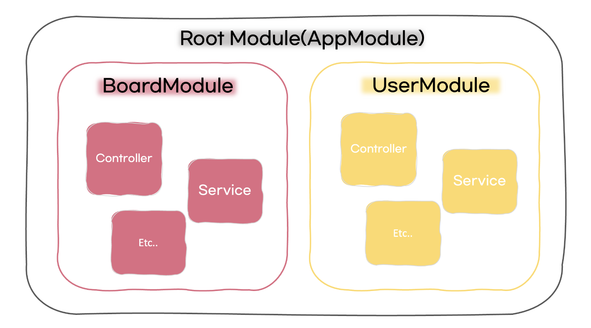
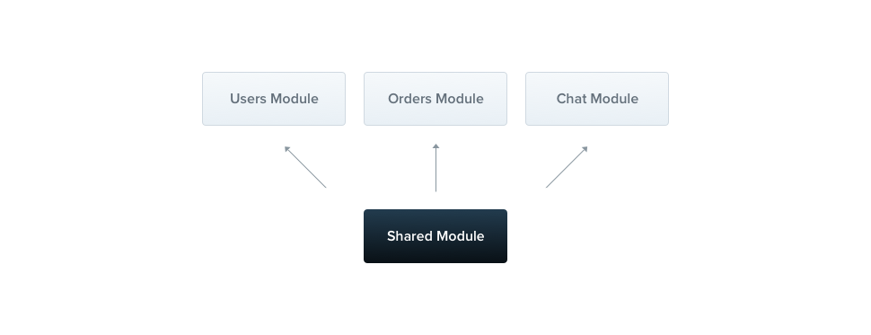
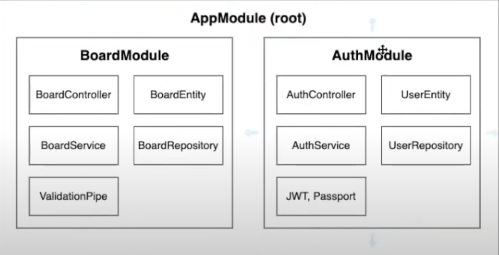

## Nest JS 모듈이란?

<figure>
    
    <figcaption><a href='https://velog.io/@dev_0livia/%EA%B2%8C%EC%8B%9C%ED%8C%90-%EB%A7%8C%EB%93%A4%EA%B8%B0-01'>그림출처:dev_0livia.log</a></figcaption>
</figure>
<br/>

NestJS에서 모듈이란, 어플리케이션을 구성하는 빌딩 블록을 뜻하며, 각각의 모듈을 모아 어플리케이션을 실행하고,
Controller, Service등을 묶어 하나의 단위로 구성하여 애플리케이션의 구조를 모듈화한다.<br/>

모듈은 @Module() 데코레이터가 달린 클래스이다.<br/>
@Module() 데코레이터는 NestJS가 애플리케이션 구조를 구성하는데 사용하는 `메타 데이터`를 제공해주는 역할을 해주고,
각 응용 프로그램엔 하나 이상의 모듈(루트 모듈)이 있다.<br/>
(루트 모듈은 Nest가 사용하는 시작점임)

### 모듈은..

모듈은 밀접하게 관련된 기능 집합으로 구성 요소를 구성하는 효과적인 방법이다.

같은 기능에 해당하는 것들은 하나의 모듈 폴더에 넣어서 사용한다.
(예를들면, UserService,UserEntity 다 같은 기능이라 UserModule안에 넣음)


모듈은 기본적으로 싱글 톤이므로 여러 모듈간에 쉽게 공급자의 동일한 인스턴스를 공유 할 수 있다.

## 모듈 생성

`nest g module boards`를 입력하면

/src/boards/경로에 boards.module.ts 파일이 생성된다.

boards.module.ts은 아래와 같이 코드가 적혀있다.

```js
import { Module } from '@nestjs/common';

@Module({})
export class BoardsModule {}
```


AppModule을 구성요소중 BoardModule를 만들었으니 이제 BoardModule안의 구성요소들을 살펴보자

```toc

```
