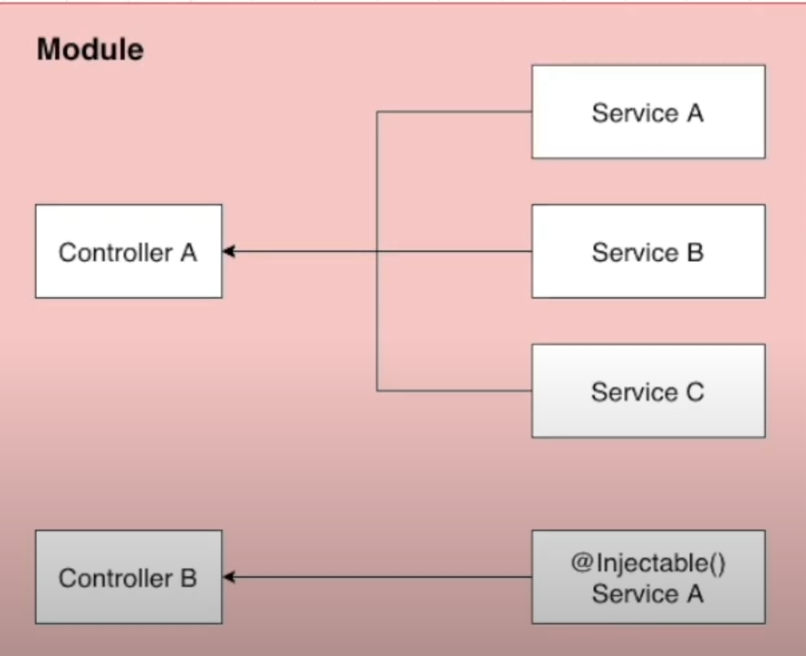
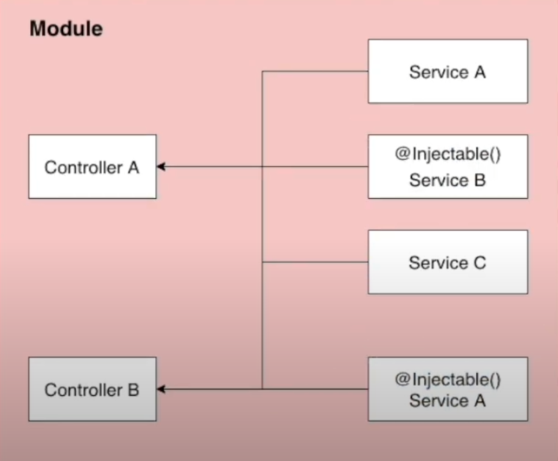

## Providers란?

프로바이더는 Nest의 기본개념이다.
대부분의 기본 Nest 클래스는 서비스(Service), 레파지토리, 팩토리, 헬퍼등의 프로바이더로 취급될 수 있다.
프로바이더의 주요 아이디어는 `종속성을 주입`할 수 있다는 점이다.
즉 객체는 서로 다양한 관계를 만들 수 있다는 것을 의미한다.
객체의 인스턴스를 연결하는 기능은 대부분 Nest 런타임 시스템에 위임될 수 있다.

여기까지가 Nest의 공식 문서에 나와있는 내용이다.
즉,



사진속 컨트롤A안에 모든걸 구현할 수 없으니(코드양이 많아지니깐) 서비스A,서비스B,서비스C로 나누고 컨트롤러 A에 넣어서 사용하는것을 `종속석 주입`이라고 한다.

여기선 서비스를 예시로 두었지만, 레포지토리, 팩토리, 헬퍼 등도 취급될 수 있다.

## Service란?

> 서비스는 소프트웨어 개발내의 공통 개념이며, NestJS, Javascript에서만 쓰이는 개념이 아님

`@Injectable` 데코레이터로 감싸져서 모듈에 제공되며, 이 서비스 인스턴스는 애플리케이션 전체에서 사용 될 수 있다.

서비스는 컨트롤러에서 데이터의 유효성 체크를 하거나 데이터베이스에 아이템을 생성하는 등의 작업을 하는 부분을 처리한다.



사진에서와 같이, 컨트롤 B에서 서비스 A를 사용해줄 수 있는데 이럴때 @Injectable()를 사용해준다.

## Provider 등록

Provider를 사용하기 위해선 Nest에 등록해줘야 사용할 수 있다.
등록하기 위해서 module파일에 providers 항목안에 해당 모듈에서 사용하고자 하는 Provider를 넣어주면 된다.

> 아래 코드 참고

```js
import { Module } from '@nestjs/common';
import { BoardsController } from './boards.controller';
import { BoardsService } from './boards.service';

@Module({
  controllers: [BoardsController],
  providers: [BoardsService], // 이곳에 넣어주면 됨
})
export class BoardsModule {}
```

## Service 만들기

Service안에서는 주로 데이터베이스 관련된 로직을 처리한다.

> EX) DB에서 데이터를 가져오거나 DB안에 게시판을 생성할 때 그 생성한 게시판 정보를 넣어주는 등의 로직을 처리함

`nest g service boards --no-spec`

위의 명령어를 터미널에 입력해주면 controller때와 마찬가지로 service.ts파일이 생성되고, module.ts에 자동으로 등록되어있다.

자동으로 등록되있는 모습..

```js
import { Module } from '@nestjs/common';
import { BoardsController } from './boards.controller';
import { BoardsService } from './boards.service';

@Module({
  controllers: [BoardsController],
  providers: [BoardsService],
})
export class BoardsModule {}
```

```toc

```
