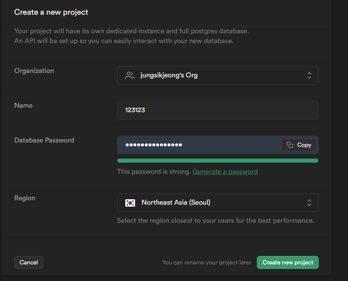
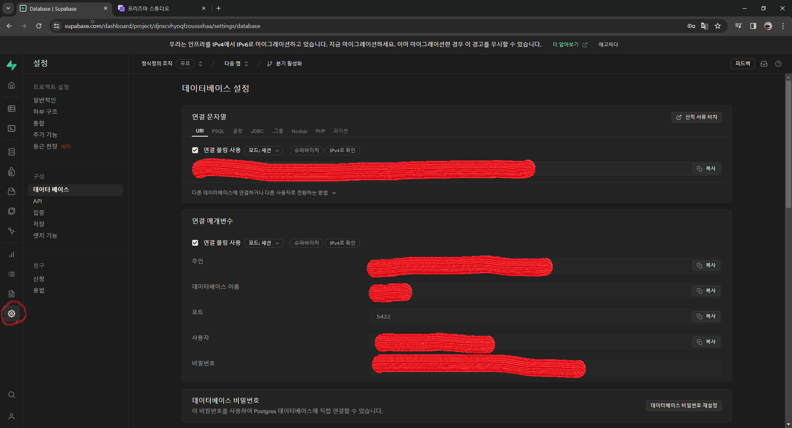
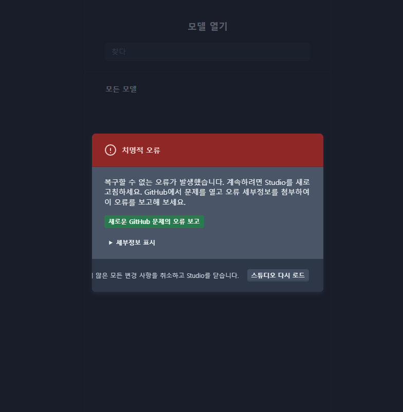
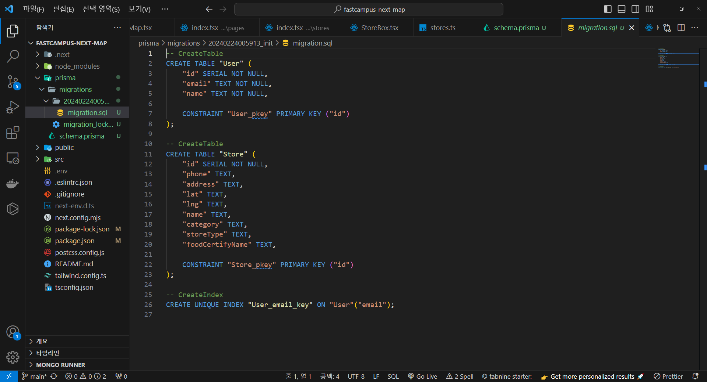
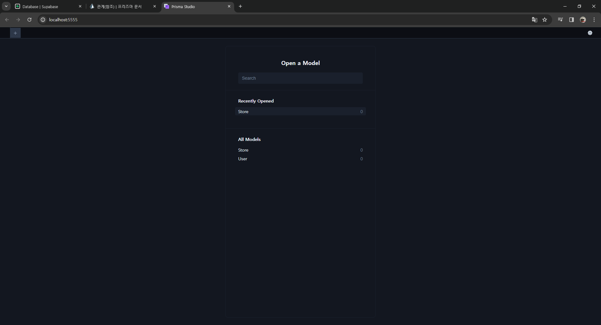
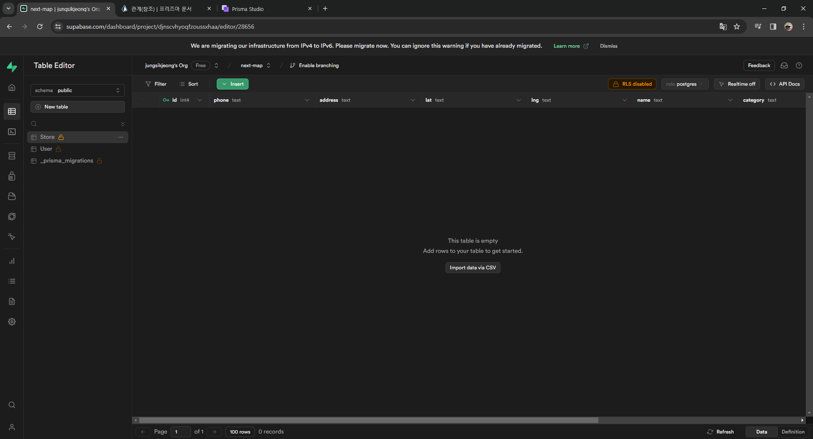
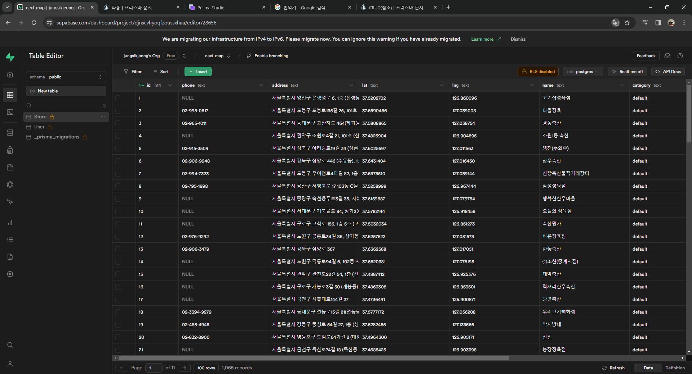

## 1 Supabase 회원가입 및 프로젝트 생성

[Supabase](https://supabase.com)에서 회원가입후 프로젝트를 생성한다.

<br/>


<br/>

위의 사진처럼 데이터베이스 패스워드를 작성후,
Region은 한국 서울로해주자

`데이터베이스 패스워드는 추후 prisma 세팅할 때 사용되므로 복사해주자`

<br/>



<br/>

이후 프로젝트가 생성되면 project setting 탭에서 URI를 복사해서 아래에서
prisma세팅할 때 붙여넣어주자.

<br/>

## 2 prisma init 및 supabase url연결

`npm i -D prisma`

`npm i @prisma/client`

`npx prisma init`

여기까지 하면 prisma/schema.prisma 파일이 생성되고,

.env 파일에 자동으로 `DATABASE_URL="postgresql://...."` 이 추가된다.

초기에 생성된 .env파일의 DATABASE_URL은 prisma에서 임의로 설정해준것이기 때문에,
이 경로를 위의 `#1`에서 카피한 Supabase의 URI를 넣어주고
`[YOUR-PASSWORD]` 부분엔 `#1`에서 설정했던 데이터베이스 패스워드를 넣어주자

`npx prisma studio` 를 해서 localhost:5555에서 화면이 잘나오면 세팅은 잘 끝난거다.

<br/>



<br/>

에러가 나오는 이유는 아직 데이터베이스 모델링을 안해줬기 때문인데 잘된거임

<br/>

## 3 prisma schema 생성 및 seed 생성

스키마 설정을 한번 해보자.

prisma/schema.prisma에 다음과 같이 코드를 작성해보자
modal User와 Store의 스키마를 작성해줬다.

<br/>

```js
generator client {
  provider = "prisma-client-js"
}

datasource db {
  provider = "postgresql"
  url      = env("DATABASE_URL")
}

model User {
    id       Int  @id @default(autoincrement())
    email    String @unique
    name     String
}

model Store {
    id        Int  @id @default(autoincrement())
    phone     String? // tel_no
    address   String? //rdn_code_nm
    lat       String? // y_dnts
    lng       String? //x_cnts
    name      String? //upso_nm
    category  String? //bizcnd_code_nm
    storeType String? //cob_code_nm
    foodCertifyName String? // crtfc_gbn_nm
}
```

- 이후 터미널에 다음과 같이 입력
  `npx prisma migrate dev --name init`

- 그럼 이런 문구가 나오고,

<br/>

```js
migrations/
  └─ 20240224005913_init/
    └─ migration.sql

Your database is now in sync with your schema.
```

<br/>

prisma/migrations/migration.sql 의 파일이 생긴다.
방금 작성한 스키마 모델이 sql형태로 변환되어 저장이된것이다.

<br/>



<br/>

위의 이미지같이 생성이되는데, 이 파일은 `절대 수정하면 안되고`
혹시나 변경 사항이 생기면 새롭게 만들어줘야한다.

`npx prisma studio`를 입력하면 #2에서는 에러가 떳던 화면이 다음과 같이 나오는걸 볼 수있다.

<br/>



<br/>

마찬가지로 원격 DB인 Supabase 홈페이지에서도 모델이 생성된거를 확인할 수 있다.
<br/>



<br/>
<br/>

## 4

`npm i -D ts-node`

> nextjs를 사용하므로 다음을 package.json에 붙여넣자

```js
"prisma": {
  "seed": "ts-node --compiler-options {\"module\":\"CommonJS\"} prisma/seed.ts"
},
```

<br/>

- prisma/seed.ts 파일 생성 후 다음처럼 입력해주자

  <br/>

> 참고로 seed.ts파일 생성 예시는 [여기서확인](https://www.prisma.io/docs/orm/prisma-migrate/workflows/seeding#how-to-seed-your-database-in-prisma-orm) 하자

<br/>

```js
import { PrismaClient } from '@prisma/client';
import * as data from '../src/data/store_data.json';

const prisma = new PrismaClient();

async function seedData() {
  // 로컬에 등록된 store_data.json 데이터중, 원하는 것들만 꺼내옴
  data?.['DATA']?.map(async (store) => {
    const storeData = {
      phone: store?.tel_no,
      address: store?.rdn_code_nm,
      lat: store?.y_dnts,
      lng: store?.x_cnts,
      name: store?.upso_nm,
      category: store?.bizcnd_code_nm,
      storeType: store?.cob_code_nm,
      foodCertifyName: store?.crtfc_gbn_nm,
    };

    // prisma 생성
    // 앞전에 생성한 스키마 StoreModal이있어서 store라고 name을 지음
    const res = await prisma.store.create({
      data: storeData,
    });
    console.log(res);
  });
}

async function main() {
  await seedData();
}

main()
  .catch((e) => {
    console.log(e);
    process.exit(1);
  })
  .finally(() => {
    prisma.$disconnect();
  });
```

<br/>

`// 프리즈마 생성`이라고 주석처리된 부분으로 프리즈마를 생성하고,
`npx prisma db seed`를 입력해주면 seed가 생성이 되고,
Supabase를 가서 확인해보면 데이터가 생성되어있는걸 볼 수 있다.

<br/>



```toc

```
