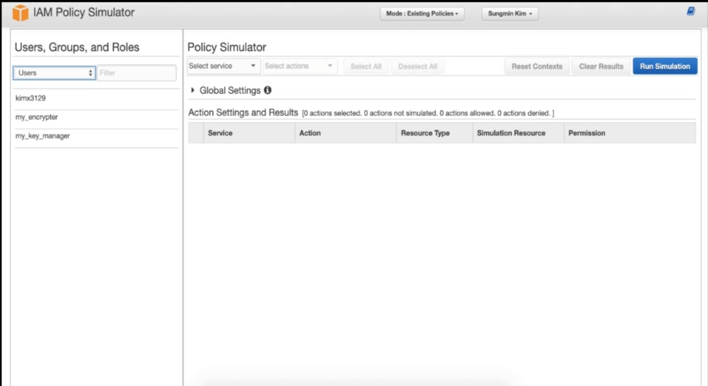

## 개념

- 개발환경 (Staging or Develop)에서 실제환경 (Production)으로 빌드하기전 IAM 정책이 잘 작동되는지 테스트하기 위해서 사용한다.

- IAM과 관련된 문제들을 디버깅하기에 최적화된 툴이다. (이미 실제로 유저에 부여된 다양한 정책들도 테스트 가능함)
  <br/>

즉,
특정 서비스를 사용하는데 제약이 있는지, 회사에서 설정한 가이드라인에 잘 맞춰져있는지, 알맞은 정책을 특정 개발자들에게 올바른 정의가 내려져있는지 확인하는 디버깅 툴이고, `개발자 A에게 부여된 모든 정책들을 근거로 어떤 서비스를 사용할 수 있는지 한번에 알 수있다.`

이렇게 생겼다..



```toc

```
