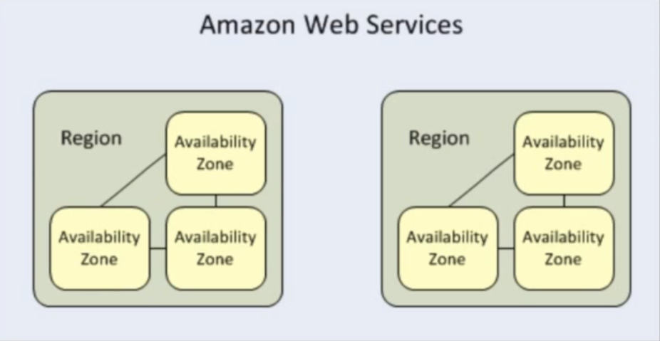

## 개념

EC2란 Elastic Compute Cloud의 약자다.

클라우드라는 공간에서 크기가 유연하게 변경되는 공간을 제공해준다.

## 다양한 지불 방법

- On-demand : 시간 단위로 가격이 고정되어 있다.

  - 오랜시간동안 선불을 내지 않고 최소한의 비용을 지불하여 EC2인스턴스를 사용하고 싶을때
  - 앱/프로그램 개발시 최초로 EC2인스턴스에 deploy할 때 유용하다.
  - 개발시작과 끝을 알 수 없는 경우에 사용한다.
  - 단기간에 끝낼 수 있는 부분에서 주로 사용이 된다.
    <br/>

- Reserved : 한정된 EC2 용량 사용 가능, 1-3년동안 시간별로 할인 적용 받을 수 있다.

  - 개발시작과 끝을 알 수 있는 경우에 사용한다.
  - 선불로 인한 컴퓨터 비용 대폭 감소
  - 개발 요구 사항이 자주 바뀌지않고, 안정적이고 개발 시간이 예측가능하다면 추천함
  - 크기를 늘이고 줄이는 기능이 없다.
    <br/>

- Spot : 입찰 가격 적용. 가장 큰 할인률을 적용받으며 특히 인스턴스의 시작과 끝기간이 전혀 중요하지 않을때 유용함
  - 단순히 비용 절감시 유용하다.
  - 인스턴스의 시작/끝시점에 구애받지 않을 경우 권장된다.

## EBS(Elastic Block Storage)

> EBS는 EC2안에 부착되어있는 가상하드디스크다.

- 저장 공간이 생성되어지며, EC2 인스턴스에 부착된다.

- 디스크 볼륨 위에 File System이 생성된다.

- EBS는 특정 \*Availability Zone에 생성된다.

<br/>
여기서 잠깐 짚고 넘어가자면
Availability Zone(AZ라고 불림)은 아래 이미지처럼 되어있다.



하나의 Region안에 여러개의 AZ가 존재할 수있다.

EC2를 사용할 때, 이 AZ를 설정해줘야한다.

## EBS 볼륨 타입

### SSD형식

- General Purpose SSD (GP2)

  - 최대 10K IOPS를 지원하며 1GB당 3IOPS 속도가 나온다.
  - 가장 보편적으로 사용된다.

- Provisioned IOPS SSD (I01)
  - 극동의 I/O률을 요구하는 환경에서 주로 사용된다.(ex,매우 큰 DB관리)
  - 10k 이상의 IOP를 지원한다.

### HDD형식

- Throughput Optimized HDD (ST1)

  - 빅데이터를 보관하고, 컴퓨터 로그파일을 보관하고 읽어들일때 사용됨
  - boot volume으로 사용 불가능함
  - 윈도우처럼 운영체제를 가질 수 없다.

- CDD HDD (SC1)

  - 파일 서버처럼 입출력이 빈번치않을 때 사용함
  - boot volume으로 사용 불가함
  - 비용 매우 저렴

- Magnetic (Sandard)
  - 디스크 1GB당 가장 싼 비용이다.
  - boot volume으로 유일하게 가능하다.

```toc

```
