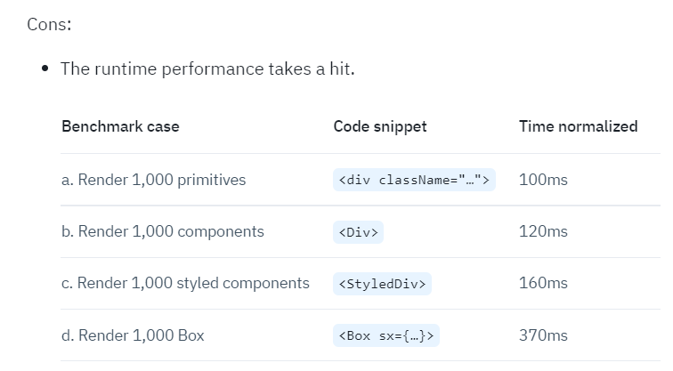

> 이 게시글은 [이곳](https://velog.io/@dishate/Mui-Box%EC%99%80-div-Mui-sx%EC%99%80-React-style-styled)을 참고하여 요약하여 작성하였습니다.

# MUI

MUI는 리액트 라이브러리 중 하나로 MUI는 구글의 디자인 철학인 `Material Design`을 구현한 자바스크립트 라이브러리입니다.

실은 materialUI라고 불리던 MUI는 5버전으로 리뉴얼 되면서 기존의 materialUI라는 이름을 버리고 MUI라는 이름으로 바뀌었다고 합니다.

## mui의 sx와 inline style의 차이점

> 원문 게시글을 요약하는 게시글이기 때문에 여기부턴 편하게 글을 작성하겠습니다.

### inline style

- html을 반환하는 jsx 문법은 react가 변환할 때 모든 속성이 props 객체의 일부가 된다.
- 따라서 랜더링때마다 style 객체가 계산되어 성능과 재사용 부분에서 추천하지 않는다.
- `inline style은 즉각적인 테스트 정도로만 사용하자.`

<br/>

### Mui sx

- sx의 사용예시는 inline style과 비슷하다.<br/>

  ```js
  js<Box sx={{ width: 100, height: 100 }}>Hello Box</Box>
  ```

- styled-component화 되어 적용된다.
- mui의 theme를 기반으로 css를 적용할 수 있다. (다크모드,미디어 쿼리,css단축약어 적용 등..)
- 재사용에 용이하지 못하다.
- inline style보다는 좋지만 다른 방법과 비교 할 때 런타임 성능이 저하된다.
  > 이미지 출처:[dishate](https://velog.io/@dishate/Mui-Box%EC%99%80-div-Mui-sx%EC%99%80-React-style-styled) 

<br/>

## Box

- 기본적으로 컴포넌트를 감싸는 Wrapper역할의 컴포넌트로 사용한다.

```js
<Box sx={{ width: 100, height: 100 }}>
  <Component1 />
  <Component2 />
</Box>
```

- mui에서 컴포넌트로 구분되지않고 레이아웃으로 구분되어있다.
- 그렇기 때문에 다른 컴포넌트로 사용 할 수있다.

```js
<Box component="span">span</Box>
<Box component="button">button</Box>
```

<br />

## 두 줄 요약

- 리액트 인라인 스타일과 mui sx 사용을 지양하자.
  (성능 이슈 및 재사용성 이슈 및 런타임 성능 저하)

- styled-component를 사용하자
  (mui를 사용하면 내부적으로 @emotion/styled를 사용해서 따로 설치할 필요없음)

참고로,
작성자는 이런식의 css 방식을 택했다고 한다.

```js
// html button tag css
const MyButton = styled.button`
...
`;

// Mui Button component css
const MyButton2 = styled(Button)`
...
`;
```

mui 컴포넌트에 css를 추가하는 경우에는 해당 컴포넌트를 재정의하고
단순 html tag에 css를 추가할 때는 새로 생성하는 방법을 사용하기로 했다고하는데,

개인적인 생각으로는 몇글자안되는 컬러 및 폰트,마진,패딩값같은 경우는 sx로 스타일을 주는것도 나쁘지않다고 생각한다.

```toc

```
