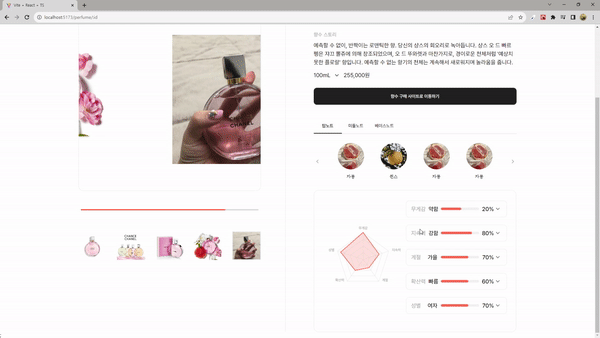
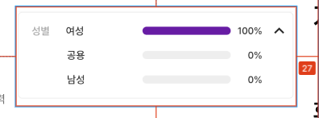
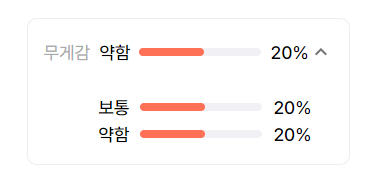
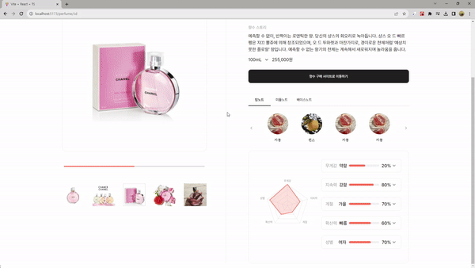

## 23.11.01

- 모던 자바스크립트 공부/코드 품질 파트 완독

  코드 품질 파트에서 `닌자 코드`섹션이 인상 깊었다.
  변수명 혹은 함수명을 어떤식으로 작명하면 안되는지를 유머러스하게 설명하는데 재밌었다.

- 팀 프로젝트 `Read A Perfume` 개발

  - 카테고리 공통 컴포넌트 개발 

    팀 프로젝트에서 내가 맡은 분야는 제품 리스트 페이지와, 제품 상세 페이지인데
    제품 리스트 페이지에 들어가는 카테고리와 메인 페이지에 들어가는 카테고리가 겹치는것 같아서 카테고리 컴포넌트를 따로 만들어서 공통적으로 사용할 수 있게끔 해주었다. 

  - 제품 상세 페이지 UI 및 css 작업

    오늘 작업한 페이지!

> 코드 구조를 생각하면서 하다보니까 뭔가 작업속도가 더딘것 같다..

## 23.11.02

- 팀 프로젝트 제품 상세페이지 UI 및 css 작업

  - 향수의 특징을 react-apexcharts 라이브러리를 사용해 레이더 차트로 표시해주었다.

  - 사용자가 좀 더 정확하게 향수의 특징을 볼 수 있도록 materialUI의 아코디언 메뉴를 사용해서 향수의 특징을 막대차트화 해주었다.

  > 이런식으로..

  

  여기서 문제는, 해당 차트의 화살표를 클릭해서 펼치면 이쁘게 딱 나오지 않는다는거다.
  디자이너분께서 짠 구조는 이런식인데..

  

  나는 누르면 이렇게 나온다.

  

  마우스 오른쪽을 클릭해서 html,css 구조를 살펴봤는데 마진값,패딩값이 주어져있는게 아니라
  div태그 두개로 요소가 나누어져있었다.

  포지션 앱솔루트를 줘서 당겨주면 어떨까? 싶어서 시도해봤다.

  

  디자인대로 됬지만, 열고 닫을때 매끄럽지가 않았고, 계절 아코디언 같은 경우 봄 차트의 마진이 좀 깨졌다.
  (포지션 앱솔루트와는 별개인듯하다. 한글자 css처리를 따로 해줘야할듯 싶다.)

  다른 방법을 찾아봐야겠다..
